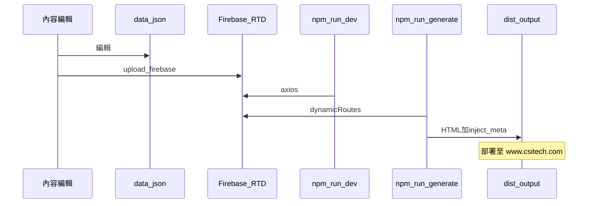

# CSI 官網專案交接文件

本文件為 **csi_v3_nuxt_vuetify** 交接總索引。**新電腦請先讀** [environment-setup.md](./environment-setup.md)。快速指令見 [README.md](../README.md)；教學場次見 [teaching-outline.md](./teaching-outline.md)。

---

## 專案概要

| 項目 | 說明 |
|------|------|
| 框架 | Nuxt 2、Vue 2、Vuetify 2、Tailwind（類別前綴 `tw-`） |
| 模式 | `ssr: false`、`target: 'static'` — 以 `nuxt generate` 產出靜態站 |
| Node | **18** |
| 開發網址 | http://localhost:8000（[`nuxt.config.js`](../nuxt.config.js) `server.port`） |
| 正式內容來源 | Firebase Realtime Database |
| 本機 JSON | [`data/`](../data/) — dev fallback；上傳後為 production 真相來源 |

---

## 資料流

**三種讀取時機：**

1. **開發** — [`layouts/default.vue`](../layouts/default.vue) 啟動時 dispatch `getArticles`、`getTeams`、`getTestimonials`；動態頁可讀本地 JSON + store。
2. **打包** — [`nuxt.config.js`](../nuxt.config.js) `dynamicRoutes()` 從 Firebase 建立路由與 **payload**。
3. **正式站** — 靜態 HTML（payload 已烘焙）；社群 meta 另由 [`scripts/inject-meta-tags.js`](../scripts/inject-meta-tags.js) 注入。

Firebase 根 URL：`https://csi-web3-resources-default-rtdb.firebaseio.com`（見 [`config/api.js`](../config/api.js)）。

---

## 目錄地圖

| 路徑 | 用途 |
|------|------|
| [`pages/`](../pages/) | 路由；`*.vue` 自動成為路由 |
| [`components/`](../components/) | 區塊元件（auto-import） |
| [`layouts/default.vue`](../layouts/default.vue) | Header + Nuxt + Footer |
| [`store/index.js`](../store/index.js) | Vuex：Firebase 列表與篩選 |
| [`store/tags.js`](../store/tags.js) | Resources 篩選選項（靜態） |
| [`data/*.json`](../data/) | 內容資料（對應 Firebase collection） |
| [`config/api.js`](../config/api.js) | Firebase URL、`DATA_ENV`、test 路徑 |
| [`assets/`](../assets/) | SCSS、圖示、需編譯資源 |
| [`static/`](../static/) | 原樣複製到網站根（`/images` 等） |
| [`scripts/upload-to-firebase.js`](../scripts/upload-to-firebase.js) | JSON → Firebase |
| [`scripts/inject-meta-tags.js`](../scripts/inject-meta-tags.js) | generate 後 SEO meta |
| [`nuxt.config.js`](../nuxt.config.js) | 版號、`generate.dir`、動態路由、hooks |

---

## 動態路由

| 路由 | Firebase / 資料 | ID 欄位 |
|------|-----------------|---------|
| `/resources/:id` | `articles` | `id` |
| `/public-safety/:id` | `public-safety` | `id` |
| `/justice-courts/:id` | `justice-courts` | `id` |
| `/crime-intelligence/:id` | `crime-intelligence` | `id` |
| `/capabilities/:id` | `capabilities` | `id` |
| `/our-staff/:uid` | `staff` | **`uid`**（非 `id`） |

404：[`pages/404.vue`](../pages/404.vue)（catch-all `*`）。

---

## 產品詳情頁元件鏈

示範：[`pages/public-safety/_id.vue`](../pages/public-safety/_id.vue)（其他產品線結構類似）

`Hero` → `Highlights` → `Capabilities` → `SysFeatures` → `Extendings` → `RelatedProducts` → `TheTeam` → `RelatedNews` → `Contact`

區塊由 JSON 欄位驅動（有 `highlights` 才渲染 `Highlights`）。

### asyncData 雙模式

- **generate 後**：`payload` → `pageData`
- **dev**：import 本地 JSON；`mounted` 再 `dispatch` store 更新

改 JSON 後：**dev 立即可見**（本地或 Firebase）；**正式站**需 upload + **generate** + **部署**。

---

## 常用指令

| 指令 | 說明 |
|------|------|
| `npm install` / `npm install --legacy-peer-deps` | 安裝依賴 |
| `npm run dev` | 開發（port **8000**） |
| `npm run dev:test` | `DATA_ENV=test` 開發 |
| `npm run upload:firebase -- <collection> --dry-run` | 預覽上傳 |
| `npm run upload:firebase -- <collection>` | 正式上傳（整包覆蓋） |
| `npm run upload:firebase:test -- articles` | 上傳至 `/test/` 路徑（限 TEST_COLLECTIONS） |
| `npm run generate` | 正式靜態打包 |
| `npm run generate:test` | 測試環境打包 |
| `npm run inject-meta dist/CSI-V10.x-MMDDYYYY` | 單獨重跑 meta 注入 |
| `npm run lint` | ESLint |

版號：修改 [`nuxt.config.js`](../nuxt.config.js) 的 `GENERATE_VERSION`（`CSI-V10.x` / `Test-V10.x`），輸出 `dist/{版本}-MMDDYYYY`。詳見 [static-generate 規則](../.cursor/rules/static-generate.mdc)。

---

## 測試環境（DATA_ENV=test）

[`config/api.js`](../config/api.js) 中 `TEST_COLLECTIONS` 預設為 `articles,leadership`。這些 collection 在 test 模式下 URL 為：

`...firebaseio.com/test/<collection>.json`

其餘 collection 仍走 production 路徑。

---

## 子文件索引

| 文件 | 讀者 |
|------|------|
| [environment-setup.md](./environment-setup.md) | 全員：Git、Node 18、npm install、dev 啟動與除錯 |
| [content-operations.md](./content-operations.md) | 內容編輯：JSON、Firebase、各類型內容慣例 |
| [release-checklist.md](./release-checklist.md) | 發佈前後檢查、部署 SOP（需團隊補齊） |
| [teaching-outline.md](./teaching-outline.md) | 講師：4 場教學 agenda 與簽核練習 |
| [FAQ.md](./FAQ.md) | 常見問題 |
| [../.cursor/skills/maintain-staff-data/SKILL.md](../.cursor/skills/maintain-staff-data/SKILL.md) | 維護 `staff.json` 完整規範 |
| [../data/Read me.md](../data/Read%20me.md) | 文章 HTML 區塊慣例 |
| [../CLAUDE.md](../CLAUDE.md) / [../AGENTS.md](../AGENTS.md) | AI 助手用架構摘要 |

---

## 帳號與外部服務（交接盤點）

交接時請逐一確認權限與保管人：

- [ ] Firebase Realtime Database console
- [ ] 正式站主機 / FTP / CI（見 [release-checklist.md](./release-checklist.md)）
- [ ] 網域與 DNS（`www.csitech.com`）
- [ ] Google Analytics（`vue-gtag`）
- [ ] 聯絡表單、職缺表單後端（若有）
- [ ] 圖片/CDN 或主機 `images/` 目錄上傳方式

---

## 建議學習順序

1. 依 [environment-setup.md](./environment-setup.md) 完成安裝與 §7 簽核
2. 閱讀本文件 + 跑通 `npm run dev`
3. 內容軌：[content-operations.md](./content-operations.md) + dry-run 上傳
4. 工程軌：改一個 component + `generate:test`
5. 聯合：[release-checklist.md](./release-checklist.md) 完整走一輪

教學場次細節見 [teaching-outline.md](./teaching-outline.md)。
